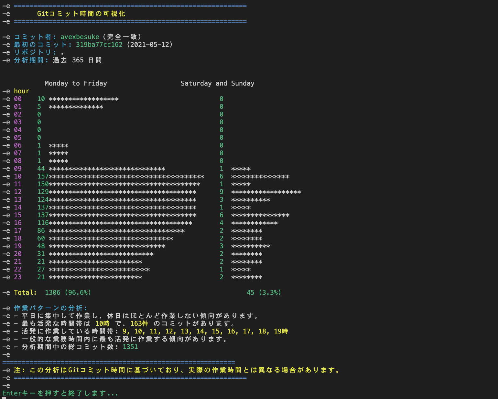

# Git Commit Analyzer

GitリポジトリのコミットパターンからGitユーザーの作業習慣を可視化するツール

*Read this in: [English](#git-commit-analyzer-1), [日本語](#git-commit-analyzer)*

## 概要

このツールはGitリポジトリから特定のユーザーのコミット情報を抽出・分析し、次の情報を提供します：

- 時間帯別のコミット傾向（平日/休日別）
- 作業パターンの分析と可視化
- 最も活発な時間帯の特定
- 作業スタイル（朝型/夜型など）の分析

## インストール方法

```bash
# リポジトリをクローン
git clone https://github.com/nakamuratetsuo/git-commit-analyzer.git

# ディレクトリに移動
cd git-commit-analyzer

# スクリプトに実行権限を付与
chmod +x git-commit-analyzer.sh
```

## 使用方法

```bash
# 基本的な使い方
./git-commit-analyzer.sh --email "user@example.com"
./git-commit-analyzer.sh --author "User Name"

# 別のリポジトリを分析
./git-commit-analyzer.sh --email "user@example.com" --repo /path/to/repo

# 過去30日間のコミットのみ分析
./git-commit-analyzer.sh --author "User Name" --days 30

# リポジトリ内の全コミット者を一覧表示
./git-commit-analyzer.sh --list-authors
```

## スクリーンショット



## ライセンス

MIT License

---

# Git Commit Analyzer

A tool to visualize Git users' work habits from repository commit patterns

## Overview

This tool extracts and analyzes commit information for a specific user from a Git repository, providing the following insights:

- Commit trends by hour (weekdays vs. weekends)
- Working pattern analysis and visualization
- Identification of most active hours
- Work style analysis (early bird/night owl patterns)

## Installation

```bash
# Clone the repository
git clone https://github.com/nakamuratetsuo/git-commit-analyzer.git

# Navigate to the directory
cd git-commit-analyzer

# Make the script executable
chmod +x git-commit-analyzer.sh
```

## Usage

```bash
# Basic usage
./git-commit-analyzer.sh --email "user@example.com"
./git-commit-analyzer.sh --author "User Name"

# Analyze a different repository
./git-commit-analyzer.sh --email "user@example.com" --repo /path/to/repo

# Analyze only commits from the past 30 days
./git-commit-analyzer.sh --author "User Name" --days 30

# List all authors in a repository
./git-commit-analyzer.sh --list-authors
```

## Screenshots


## License

MIT License
